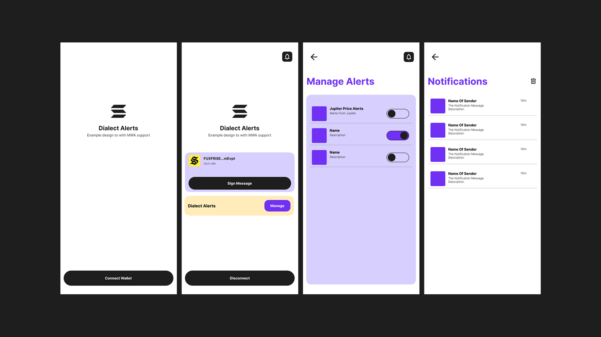
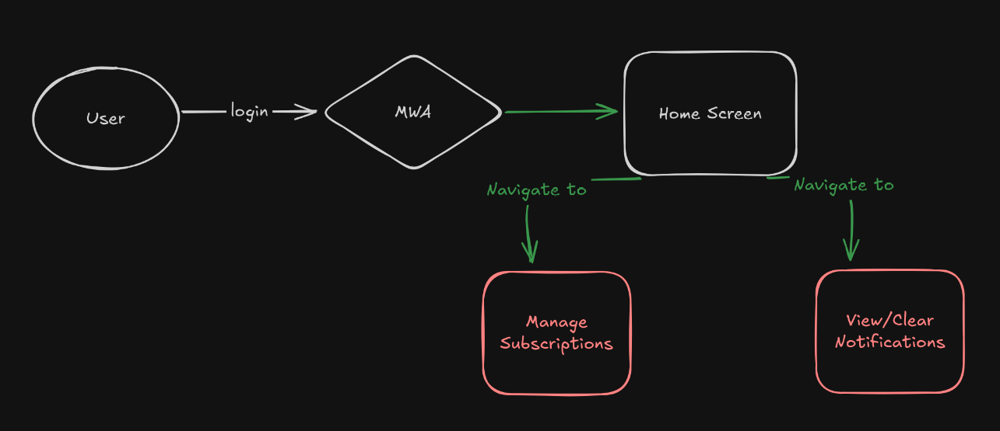

# Welcome to Dialect Alerts!

A React Native example app to showcase [Dialect Alerts](https://docs.dialect.to/alerts) setup with Solana Mobile Wallet Adapter (MWA). This example demonstrates integration of Dialect alerts for notifications subscriptions and user notifications management.



Built on top of the [Infinite Red](https://infinite.red) Ignite boilerplate for React Native development.

## 📁 Project Flow



## 🚀 Getting Started

### Prerequisites

- Android development environment
- Setup Device/Emulator
- Install a MWA compliant Wallet app (Solflare/Phantom)

### Cloning the example

```bash
git clone --filter=blob:none --sparse https://github.com/0Xsolcreator/react-native-templates.git
cd react-native-templates/
git sparse-checkout set dialect-alerts
```

### Installation and Running the app

```bash
yarn install
yarn android
```

#### For subsequent runs use `yarn start`

## 🔧 Development

### Project Structure

```
src/
├── app/                 # App navigation and screens
├── components/          # Reusable UI components
├── services/            # Dialect alerts API management via RTK Query
├── store/               # Redux store to maintain and persist user states
└── theme/               # UI theme, colors, and styling
```

### Key Technologies

- **React Native**: Mobile app framework
- **Dialect Alerts**: Notification service
- **Solana Mobile Wallet Adapter**: Wallet integration
- **Ignite**: React Native boilerplate
- **TypeScript**: Type safety

## ⚠️ Important Notes

- Currently the Mobile Wallet Adapter only supports Android devices
- There is an existing issue with Phantom wallet actions
- Ensure you have a compatible wallet app installed

## 🤝 Contributing

1. Fork the repository
2. Create a feature branch: `git checkout -b feature/amazing-feature`
3. Commit your changes: `git commit -m 'Add amazing feature'`
4. Push to the branch: `git push origin feature/amazing-feature`
5. Open a Pull Request

## 🔗 Links

- [Dialect Alerts Documentation](https://docs.dialect.to/alerts)
- [Solana Mobile Wallet Adapter](https://docs.solana.com/wallet-adapter/mobile)
- [Ignite React Native Boilerplate](https://github.com/infinitered/ignite)
