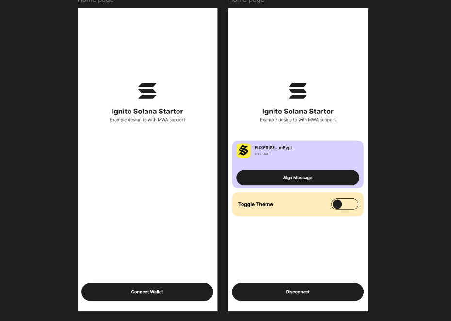

# Welcome to solana ignited starter!



A React Native starter app with Solana Mobile Wallet Authentication (MWA) integration for Android devices. This project demonstrates how to connect, disconnect, and sign messages using mobile wallet apps.

Built on the [Infinite Red](https://infinite.red) Ignite boilerplate for React Native development.


## 📁 Project Structure

```tree
src
├── app
│   ├── _layout.tsx          # Solana Web3 setup & crypto operations
│   └── index.tsx            # Entry component (Expo Router)
├── store
│   ├── features
│   │   └── authSlice.ts     # Authentication state management
│   └── store.ts             # Redux store configuration
└── utils
    └── walletUtils.ts       # Standalone wallet interaction functions
```

## 🔧 Core Components

- **`_layout.tsx`** - Configures Solana Web3.js and cryptographic operations
- **`index.tsx`** - Main entry point using Expo Router
- **`authSlice.ts`** - Redux slice for wallet authentication state
- **`walletUtils.ts`** - Standalone functions for MWA wallet interactions

- This template uses expo router so index.tsx marks as the entry component that will be loaded on app startup.

- The Redux storege management is setup in the store folder.

## 🚀 Getting Started

### Prerequisites

- Android development environment
- Setup Device/Emulator
- Install a MWA compliant Wallet app (Solflare/Phantom)

### Cloning the starter

```bash
git clone --filter=blob:none --sparse https://github.com/0Xsolcreator/react-native-templates.git 
cd react-native-templates/
git sparse-checkout set ignite-solana-starter
```

### Installation

```bash
yarn install
yarn start
```

> Important Note: Currently the Moblile Wallet Adapter only supports android devices and there is an existing issue with Phantom wallet actions.

